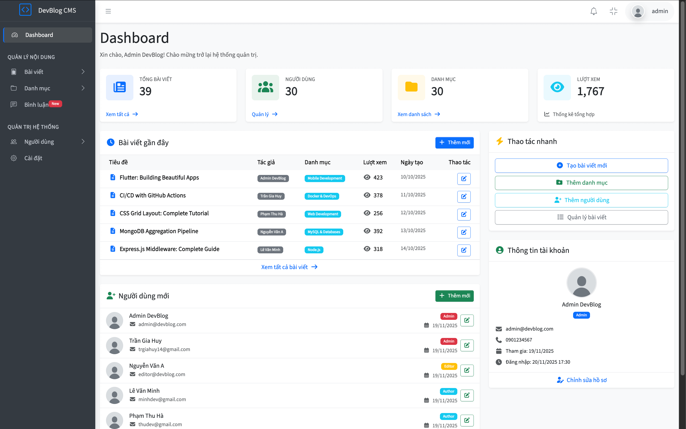
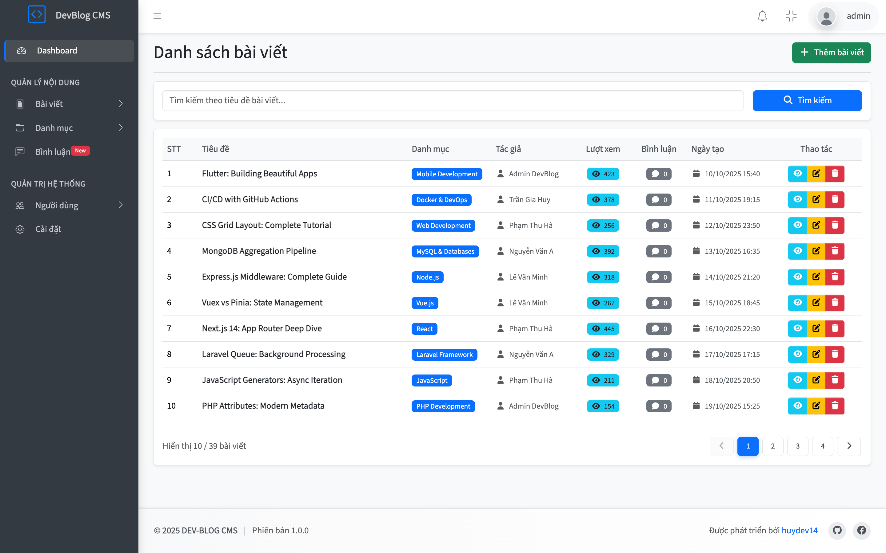
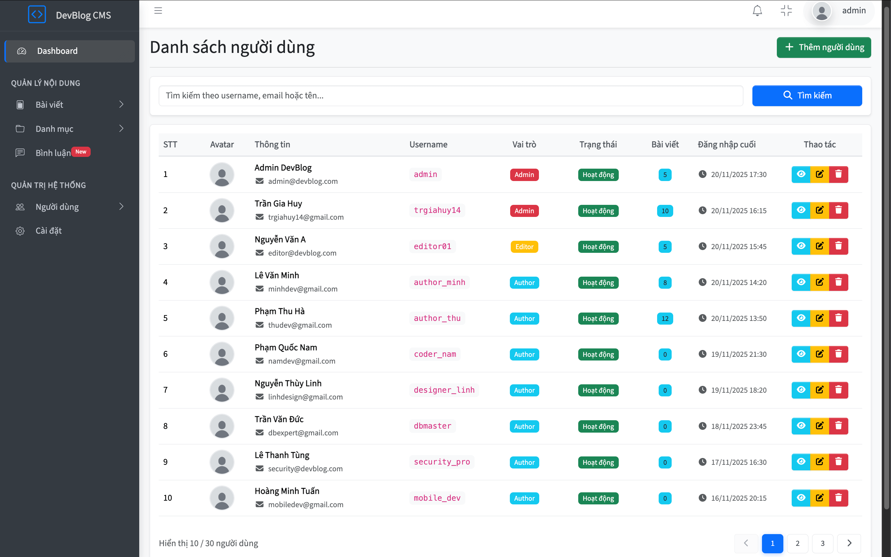
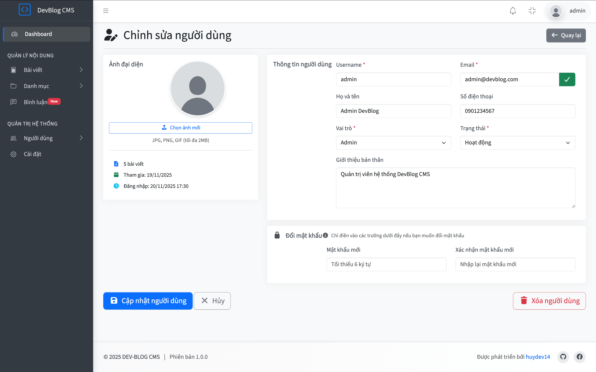
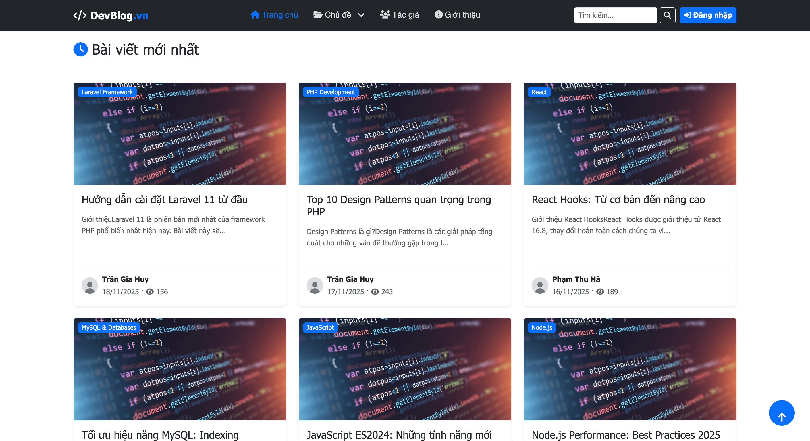

# 📝 DevBlog CMS

A modern blog management system built with PHP MVC architecture, featuring a comprehensive admin panel with full CRUD operations for users, posts, and categories management.

 


## 📸 Screenshots

### 🎛️ Admin Panel

<table>
  <tr>
    <td width="50%">
      
      <p align="center"><b>Dashboard</b></p>
    </td>
    <td width="50%">
      
      <p align="center"><b>Posts Management</b></p>
    </td>
  </tr>
  <tr>
    <td width="50%">
      
      <p align="center"><b>Users Management</b></p>
    </td>
    <td width="50%">
      
      <p align="center"><b>User Editing</b></p>
    </td>
  </tr>
</table>

### 🌐 Client Pages

<table>
  <tr>
    <td width="50%">
      
      <p align="center"><b>Homepage</b></p>
    </td>
    <td width="50%">
      
      <p align="center"><b>Post Detail</b></p>
    </td>
  </tr>
</table>

## ✨ Features

### 🔐 Authentication & Authorization

- Session-based authentication (login/logout)
- User registration with email verification
- Role-based access control (Admin, Editor, Author)

### 📊 Content Management

- **Posts**: Full CRUD operations with search, filter, and pagination
- **Categories**: Manage blog categories with post count tracking
- **Users**: User management with role and status control
- Form validation for all inputs
- Image upload support for user avatars and post thumbnails

### 🛡️ Security

- PDO prepared statements (SQL injection prevention)
- XSS and CSRF protection
- Bcrypt password hashing
- Secure file upload validation

### 🎨 User Interface

- Responsive admin panel (AdminLTE 4)
- Clean and modern client-facing blog
- Mobile-friendly design

## 🛠 Tech Stack

**Backend:** PHP 8.2+, MySQL 8.0, PDO, Composer (PSR-4 autoload), PHP-DotEnv, PHPMailer  
**Frontend:** AdminLTE 4, Bootstrap 5.3, Font Awesome

## 📦 Requirements

- PHP >= 8.2
- MySQL >= 8.0 or MariaDB >= 10.4
- Composer
- Apache/Nginx with mod_rewrite enabled
- XAMPP/WAMP/MAMP

## 🚀 Installation

### 1. Clone the Repository

```bash
git clone https://github.com/trgiahuy14/devblog-cms-php.git
cd devblog-cms-php
```

### 2. Install Dependencies

```bash
composer install
```

### 3. Configure Environment

Copy the example environment file and edit it:

```bash
 # Copy .env.example to .env
cp .env.example .env
```

Update the following settings in `.env`:

```env
# Database Configuration
DB_HOST=localhost
DB_NAME=devblog_db
DB_USER=root
DB_PASS=your_password

# Application URL
BASE_URL=http://localhost/devblog-cms-php
APP_BASE_PATH=/devblog-cms-php

# Mail Configuration (for email features)
MAIL_HOST=smtp.gmail.com
MAIL_USER=your-email@gmail.com
MAIL_PASS=your-app-password
```

**📧 Gmail Setup (Optional):**

If you want to enable email features:

1. Enable 2-factor authentication on your Gmail account
2. Generate an App Password: https://myaccount.google.com/apppasswords
3. Use the generated 16-character password in `MAIL_PASS`

### 4. Setup Database

**Option A: Using MySQL CLI**

```bash
mysql -u root -p < database/devblog_db.sql
```

**Option B: Using phpMyAdmin**

1. Open phpMyAdmin
2. Create a new database named `devblog_db`
3. Import the file `database/devblog_db.sql`

### 5. Access the Application

1. Make sure Apache is running in XAMPP/WAMP
2. Open your browser and navigate to: `http://localhost/devblog-cms-php/`
3. Login with the default admin account:

### Default Accounts

The system comes with pre-configured test accounts:

| Role   | Email              | Password | Description        |
| ------ | ------------------ | -------- | ------------------ |
| Admin  | admin@devblog.com  | 123456   | Full system access |
| Editor | editor@devblog.com | 123456   | Content management |
| Author | huydev@gmail.com   | 123456   | Post creation      |

## 📁 Project Structure

```
devblog-cms-php/
├── database/           # SQL file testing dump
├── public/             # index.php, assets, .htaccess
├── routes/             # Route definition
├── src/
│   ├── app/
│   │   ├── Controllers/   # Admin & Client controllers
│   │   ├── Models/        # Database entities
│   │   ├── Views/         # Templates (layouts, emails)
│   │   ├── Middlewares/   # Authentication guard
│   │   └── Services/      # Mail Service, File Upload Service
│   ├── Core/              # Core files (Router, Controller, Model, View, Database)
│   ├── configs/           # Configuration file
│   └── helpers/           # Helper functions
├── vendor/                # Composer dependencies
├── .env                   # Environment config
```

## 🛠️ Development

### Debug Mode

Enable detailed error messages in `.env`:

```env
APP_DEBUG=true
```

## 📝 License

This project is licensed under the MIT License.

## 👤 Author

**Tran Gia Huy**

- GitHub: [@huydev14](https://github.com/huydev14)
- Email: huydev14@gmail.com

---

<p align="center">Made with ❤️ by Tran Gia Huy</p>
